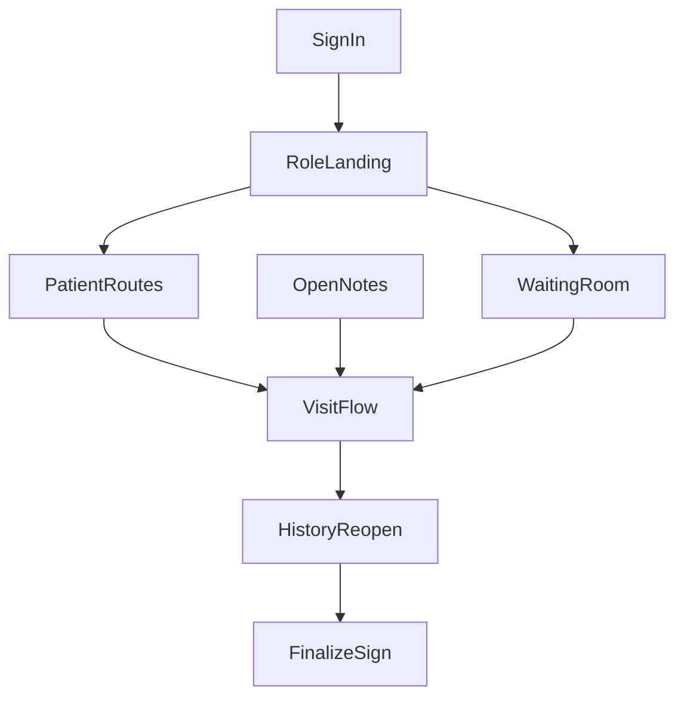

# April 1 Batch Execution Plan

**Scope:** Demo-critical release stabilization only.  
**Constraint:** This plan is driven by markdown history, not by repo-wide cleanup goals.  
**Primary framing:** Close the release gates documented in [`APRIL_1_PHASE2_RELEASE_GATES.md`](./APRIL_1_PHASE2_RELEASE_GATES.md) while preserving the guardrails in [`APRIL_1_PHASE2_DEMO_GUARDRAILS.md`](./APRIL_1_PHASE2_DEMO_GUARDRAILS.md).

---

## Status Normalization

| Status | Meaning in this plan |
|---|---|
| `fixed locally` | Documented as fixed in repo before live re-validation |
| `fixed and validated` | Documented as behaviorally proven in validation |
| `fixed locally but not yet deployed` | Explicitly fixed in repo, but not live-validated at that point |
| `still open` | No documented narrow fix yet |
| `guarded/deferred` | Explicitly kept out of the approved demo path until proven |

---

## Ordered Batch List

### Batch 1 — Close Demo-Critical Release Gates

**Goal:** Close the four release gates that still determine whether the demo path is safe:
- `RG-1` role landing after sign-in
- `RG-2` hydrated route continuity on patient chart / visit history / open notes
- `RG-3` waiting-room `Assign To Me`
- `RG-4` one proven save -> history -> reopen -> finalize/sign path on an approved record

**Why first:** Every later workflow depends on these being green on the deployed build.

### Batch 2 — Harden The Approved Clinician Continuation Path

**Goal:** If Batch 1 reveals remaining instability after redeploy validation, narrow the scope to only the persistence and handoff surfaces that the approved presenter path touches.

**Why second:** This batch exists to finish the approved path, not to expand it.

### Batch 3 — Optional Telehealth / AI Rehearsal

**Goal:** Rehearse Twilio, recording, and AI only if Batches 1 and 2 are already green on the same deployed build.

**Why third:** All markdown sources treat this as optional or unsafe unless explicitly re-tested.

---

## Normalized Bug Ledger

| ID | Issue | Source of truth | Historical state | Batch | Current planning posture | Likely files |
|---|---|---|---|---|---|---|
| BL-1 | Post-login landing goes to `/` instead of role home | [`APRIL_1_PHASE2_RELEASE_GATES.md`](./APRIL_1_PHASE2_RELEASE_GATES.md) RG-1 | `fixed locally but not yet deployed` | Batch 1 | Must be closed and re-validated first | `app/(auth)/sign-in/sign-in-form.tsx` |
| BL-2 | Client navigation dead on hydrated workflow screens | [`APRIL_1_PHASE2_RELEASE_GATES.md`](./APRIL_1_PHASE2_RELEASE_GATES.md) RG-2 | `fixed locally but not yet deployed` | Batch 1 | Must be closed and re-validated first | `app/(app)/patients/patients-list.tsx`, `app/(app)/patients/[id]/visit-history/visit-history-content.tsx`, `app/(app)/open-notes/open-notes-content.tsx`, `app/_lib/utils/format-date.ts` |
| BL-3 | Waiting-room `Assign To Me` fails with fetch error | [`APRIL_1_PHASE2_RELEASE_GATES.md`](./APRIL_1_PHASE2_RELEASE_GATES.md) RG-3 | `still open` | Batch 1 | Primary unresolved live blocker if handoff stays in scope | `app/(app)/waiting-room/waiting-room-list.tsx`, `app/_actions/visits.ts` |
| BL-4 | Save -> history -> reopen -> finalize/sign path not proven | [`APRIL_1_PHASE2_RELEASE_GATES.md`](./APRIL_1_PHASE2_RELEASE_GATES.md) RG-4 | `guarded/deferred` until smoke proves it | Batch 1 | Must be behaviorally proven on one approved patient/visit pair | `app/_components/visit/new-visit-form.tsx`, `app/_actions/visits.ts`, `app/(app)/patients/[id]/visit-history/visit-history-content.tsx`, `app/(app)/patients/[id]/visit-history/[visitId]/visit-details-content.tsx` |
| BL-5 | Fresh new-visit flow leaves Save disabled for short-path demo | [`APRIL_1_PHASE2_DEMO_VALIDATION_TRACKER.md`](./APRIL_1_PHASE2_DEMO_VALIDATION_TRACKER.md), [`Known Risks to Avoid in Demo.md`](./Known%20Risks%20to%20Avoid%20in%20Demo.md) | `guarded/deferred` | Batch 1 guardrail, not a primary fix target | Prefer pre-seeded continue path; only treat as a fix target if the approved path cannot avoid it | `app/_components/visit/new-visit-form.tsx` |
| BL-6 | Continue-note navigation / title / save readiness | [`April 1 Demo Stabilization Tracker.md`](./April%201%20Demo%20Stabilization%20Tracker.md), [`APRIL_1_PHASE2_DEMO_VALIDATION_TRACKER.md`](./APRIL_1_PHASE2_DEMO_VALIDATION_TRACKER.md) | `fixed locally` for title/save readiness, but live navigation still failed | Batch 1 | Validate as part of approved continuation path | `app/(app)/open-notes/open-notes-content.tsx`, `app/_components/visit/new-visit-form.tsx` |
| BL-7 | Finalize authorization mismatch across surfaces | [`April 1 Demo Stabilization Tracker.md`](./April%201%20Demo%20Stabilization%20Tracker.md), [`APRIL_1_DEMO_STABILIZATION_TRACKER.md`](./APRIL_1_DEMO_STABILIZATION_TRACKER.md) | `fixed locally` | Batch 1 validation-adjacent | Validate only if persistence reaches finalize/sign | `app/_actions/visits.ts`, `app/api/visits/[visitId]/recording/finalize/route.ts`, `app/(app)/patients/[id]/visit-history/[visitId]/visit-details-content.tsx` |
| BL-8 | Social-history nested merge | [`April 1 Demo Stabilization Tracker.md`](./April%201%20Demo%20Stabilization%20Tracker.md) | `fixed locally` | Batch 2 optional confirmation | Not part of Batch 1 unless the approved path specifically uses social history | `app/_actions/social-history.ts` |
| BL-9 | Twilio / recording / AI path | [`APRIL_1_PHASE2_DEMO_GUARDRAILS.md`](./APRIL_1_PHASE2_DEMO_GUARDRAILS.md), [`APRIL_1_DEMO_STABILIZATION_SUMMARY.md`](./APRIL_1_DEMO_STABILIZATION_SUMMARY.md) | `guarded/deferred` | Batch 3 | Keep out of the presenter path until Batches 1-2 are green | `app/(app)/visit/[visitId]/call/call-page-content.tsx`, `app/(app)/join/[token]/join-call-content.tsx`, `app/api/visits/[visitId]/recording/finalize/route.ts`, `app/api/ai/*` |
| BL-10 | Documents / orders / ICD-10 risk | [`Known Risks to Avoid in Demo.md`](./Known%20Risks%20to%20Avoid%20in%20Demo.md), [`April 1 Audit.md`](./April%201%20Audit.md) | `guarded/deferred` | Out of scope | Avoid for this release pass unless they block the approved demo story | Various, intentionally not targeted in Batch 1 |

---

## Exact Batch 1 Scope

### In Scope

1. Re-validate or re-close `RG-1` role landing:
   - nurse -> `/patients`
   - doctor -> `/waiting-room`
2. Re-validate or re-close `RG-2` client navigation on:
   - patient chart -> `Visit History`
   - visit history -> `Log New Visit` if still part of approved flow
   - open notes -> `Continue Note`
3. Fix or explicitly route around `RG-3` waiting-room `Assign To Me`.
4. Prove `RG-4` on one approved patient/visit pair:
   - sign in
   - continue note or approved handoff path
   - save
   - reopen in history
   - finalize/sign
5. Keep the approved presenter path centered on a **pre-seeded continue visit**, not a fresh blank visit.

### Explicitly Out Of Scope

- Repo-wide lint cleanup
- Repo-wide typing cleanup
- `visit-details-content.tsx` broad `any` cleanup unless it directly blocks finalize on the approved path
- Documents / orders / ICD-10 polishing
- Search-bar/layout/UI polish
- Twilio / recording / AI enhancement work
- Offline-sync cleanup or feature work unless it directly blocks the approved path
- Broad auth/helper refactors beyond what the approved flow requires

---

## Batch 1 File Inspection List

### Primary file set

- [`app/(auth)/sign-in/sign-in-form.tsx`](./app/(auth)/sign-in/sign-in-form.tsx)
- [`app/(app)/patients/patients-list.tsx`](./app/(app)/patients/patients-list.tsx)
- [`app/(app)/patients/[id]/visit-history/visit-history-content.tsx`](./app/(app)/patients/%5Bid%5D/visit-history/visit-history-content.tsx)
- [`app/(app)/open-notes/open-notes-content.tsx`](./app/(app)/open-notes/open-notes-content.tsx)
- [`app/_lib/utils/format-date.ts`](./app/_lib/utils/format-date.ts)
- [`app/(app)/waiting-room/waiting-room-list.tsx`](./app/(app)/waiting-room/waiting-room-list.tsx)
- [`app/_actions/visits.ts`](./app/_actions/visits.ts)
- [`app/_components/visit/new-visit-form.tsx`](./app/_components/visit/new-visit-form.tsx)

### Validation-adjacent file set

- [`app/api/visits/[visitId]/recording/finalize/route.ts`](./app/api/visits/%5BvisitId%5D/recording/finalize/route.ts)
- [`app/(app)/patients/[id]/visit-history/[visitId]/visit-details-content.tsx`](./app/(app)/patients/%5Bid%5D/visit-history/%5BvisitId%5D/visit-details-content.tsx)

### Why these files first

Batch 1 should only touch files on this shortest demo-critical path.

---

## Batch 1 Validation Checklist

### Required validation

- [ ] Nurse signs in and lands directly on `/patients`
- [ ] Doctor signs in and lands directly on `/waiting-room`
- [ ] Patient chart `Visit History` navigation works
- [ ] `Open Notes -> Continue Note` navigates successfully
- [ ] If waiting-room handoff stays in scope, `Assign To Me` transitions correctly without fetch failure
- [ ] Approved patient/visit pair supports one full:
  - save
  - history
  - reopen
  - finalize/sign
- [ ] No hydration/runtime route break on:
  - `/patients`
  - `/patients/[id]/visit-history`
  - `/open-notes`
- [ ] Nurse and doctor remain in isolated browser sessions

### Evidence to capture

- Route-level screenshots for nurse and doctor landing
- One successful continuation path screenshot
- One successful history reopen screenshot
- One successful finalize/sign result screenshot
- Console/network capture only if a blocker reproduces

### Validation standard

Batch 1 is not complete until the approved path is proven on the deployed build being prepared for demo use.

---

## Batch 2 Plan

### Scope

- Only pursue Batch 2 if Batch 1 still exposes instability after targeted fixes or redeploy-time validation.
- Limit work to the continuation and persistence chain, not optional feature breadth.

### Candidate items

- Continue-note / reopen edge cases that survive Batch 1
- Finalize/sign visibility or authorization mismatches that survive Batch 1
- Social-history merge confirmation only if the presenter path needs it

### Non-goals

- Twilio/call flow expansion
- Repo-wide cleanup
- Broad chart-section bug harvesting

---

## Batch 3 Plan

### Scope

- Twilio / recording / AI only after Batches 1 and 2 are green on the same deployment

### Candidate items

- Waiting-room -> assign -> call
- Patient join token path
- Recording finalize
- Transcript/parse success

### Non-goals

- Using these paths in the live demo without same-day rehearsal proof

---

## Recommended Batch 1 Branch And PR

- **Branch name:** `batch-1-demo-critical-release-gates`
- **PR title:** `Batch 1: close demo-critical release gates`

---

## Batch 1 Summary

Batch 1 should be treated as a **release-gate closure batch**, not a cleanup batch. The approved path is:

1. role-correct sign-in
2. stable chart/open-notes navigation
3. approved continuation or handoff route
4. one proven save -> reopen -> finalize/sign chain

Anything outside that path should remain out of scope unless it directly blocks the demo-critical workflow.
