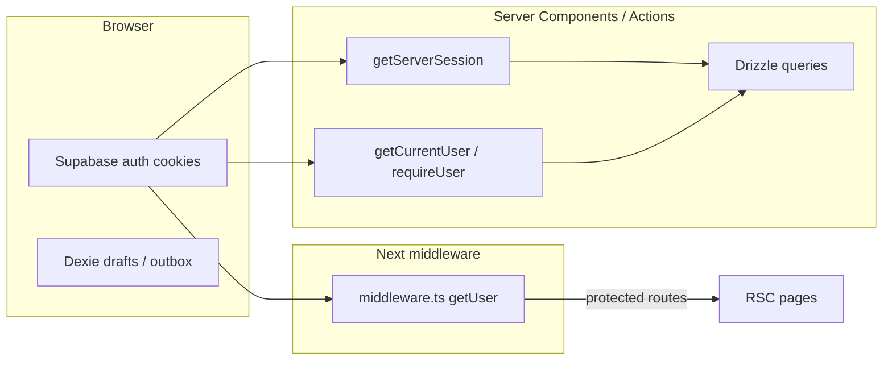
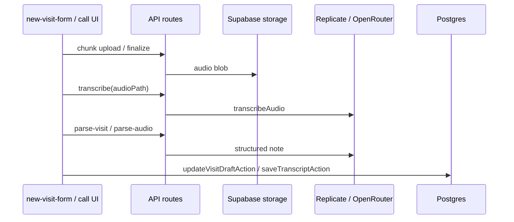

# April 1 Audit

**Product:** Telemedicine / EMR web app (`tele-medical` in workspace `Vault`)  
**Audit date:** April 1, 2026  
**Demo target:** April 2, 2026  
**Auditor role:** Code-grounded engineering audit (read paths, routes, actions, schema).  

**Scope:** [`/Users/kejhawnbrown/Desktop/Vault/tele-medical`](/Users/kejhawnbrown/Desktop/Vault/tele-medical) only.  
**Out of scope:** [`HairNet/`](/Users/kejhawnbrown/Desktop/Vault/HairNet) (hair-booking MVP), [`gq-start/`](/Users/kejhawnbrown/Desktop/Vault/gq-start), [`Proctoring-Application/`](/Users/kejhawnbrown/Desktop/Vault/Proctoring-Application).

**Operating document (source of truth):** **Atlas Telemedicine Platform Operating Document** (PDF, ~162 pages) — product vision (Jamaica / mission telehealth), **MVP Requirements – Telehealth Clinical Documentation App v1.0** (Document 1 Patient Master Profile, Document 2 Visit Note, FR-1–FR-16, NFRs), **Clinical Note Recording & Handoff** (nurse starts note → provider opens “Open Visits” → provider signs; nurse cannot finalize; digital handoff; optional note lock), appended **ICF Telehealth + EMR** system requirements (workflows A–H, telehealth module, offline/sync, AI modules), meeting notes, mockup feedback, and a **prioritized bug / UX backlog** (Log History 404, orders/PMH, session, Save Visit / POC tab, etc.). The PDF is maintained **outside** this git workspace (e.g. local Cursor PDF storage); it is **not** vendored into `tele-medical/`. [`gq-start/docs/DEMO_DAY_ONE_PAGE_OPERATING_DOC_2026-03-05.md`](/Users/kejhawnbrown/Desktop/Vault/gq-start/docs/DEMO_DAY_ONE_PAGE_OPERATING_DOC_2026-03-05.md) is unrelated (Genius Quotient). This audit compares **`tele-medical` code** to the **Atlas** intent and to the **embedded issue list** in that PDF.

---

## 1. Executive Summary

The `tele-medical` app is a **Next.js 16 (App Router)** clinician-facing EMR: **Supabase Auth** (cookie/session), **Postgres** via **Drizzle ORM**, **Dexie** for offline visit drafts, **Twilio** for video/SMS/email, and **API routes** for uploads, AI transcription/parse, and chunked visit recording. Core objects are **patients** (wide JSON columns for chart sections), **visits** (status, priority, appointment type, Twilio fields), **notes** (JSON visit note + audit), and **transcripts**.

**Demo stability is most threatened by:**

1. **`getServerSession()` returning `null` during a global 5s “rate limit cooldown”** — any server component or action that uses it can mis-treat a valid user as logged out (`redirect("/sign-in")`) or skip rendering role context. This is implemented in [`app/_lib/supabase/server.ts`](app/_lib/supabase/server.ts) and is a prime suspect for **intermittent 404/redirect/crash narratives** under load or burst navigation.
2. **A confirmed dead route:** sidebar **“Log History”** links to `/patients/{id}/log-history` but **no `page.tsx` exists** for that path — see [`components/side-nav.tsx`](components/side-nav.tsx) (`medicalSections` entry `log` → `href: "/log-history"`). This yields **Next.js 404** for a prominent nav item.
3. **Visit save UX:** **Save Visit** is disabled until **every** section in `getSectionsForRole()` is in `reviewedSections`, and while offline (`!isOnline`). Section review is updated in `handleSectionChange` in [`app/_components/visit/new-visit-form.tsx`](app/_components/visit/new-visit-form.tsx). This matches reports of **Save blocked until revisiting Point of Care** (POC is a required section in [`section-stepper.tsx`](app/_components/visit/section-stepper.tsx)).
4. **Continue Note** deep-links to [`/patients/[id]/new-visit?visitId=...`](app/(app)/patients/[id]/new-visit/page.tsx) but the form still renders a **“New Visit”** heading — hardcoded in `new-visit-form.tsx` (~line 1059).
5. **Social history updates** use shallow merge at the top level in [`app/_actions/social-history.ts`](app/_actions/social-history.ts); partial `updates.occupation` can **clobber nested fields** in `existing.occupation`.
6. **No automated test suite** in [`package.json`](package.json) (lint/build/dev only); regression risk is manual.

---

## 2. Product Intent vs Current Build

| Intended outcome (from product / demo framing) | Current build |
|-----------------------------------------------|---------------|
| Secure clinician login | **Implemented:** Supabase auth + middleware protected routes ([`middleware.ts`](middleware.ts)); role from `users` table or `user_metadata` ([`getServerSession`](app/_lib/supabase/server.ts), [`getCurrentUser`](app/_lib/auth/get-current-user.ts)). |
| Patient master profile | **Implemented:** [`patients`](app/_lib/db/drizzle/schema.ts) + sub-pages under [`app/(app)/patients/[id]/`](app/(app)/patients/[id]/). |
| Visit create + continue | **Implemented:** [`new-visit/page.tsx`](app/(app)/patients/[id]/new-visit/page.tsx) + [`NewVisitForm`](app/_components/visit/new-visit-form.tsx); continue via query `visitId`. **Labeling wrong** for continue flow (see §13). |
| Audio capture / upload / transcription | **Implemented:** API [`app/api/upload/audio`](app/api/upload/audio/route.ts), [`app/api/ai/transcribe`](app/api/ai/transcribe/route.ts), recording chunk/finalize under [`app/api/visits/[visitId]/recording/`](app/api/visits/[visitId]/recording/). |
| Structured AI visit notes | **Implemented:** Zod schema [`app/_lib/visit-note/schema.ts`](app/_lib/visit-note/schema.ts), parse routes [`parse-visit`](app/api/ai/parse-visit/route.ts), [`parse-audio-openrouter`](app/api/ai/parse-audio-openrouter/route.ts). |
| Draft review + finalization | **Implemented:** Dexie drafts + server actions in [`app/_actions/visits.ts`](app/_actions/visits.ts); `finalizeVisitAction` syncs to patient on **signed** status via [`visit-sync`](app/_actions/visit-sync.ts). |
| Patient history (PMH, vitals, social) | **Implemented** as routes + JSON columns; **merge bugs possible** (social §13). |
| Multi-user handoff | **Partial:** Visit assignment + `clinicianId` on patient/visit ([`assignVisitToMeAction`](app/_actions/visits.ts)); **signing** requires `patient.clinicianId === user.id` ([`finalizeVisitAction`](app/_actions/visits.ts)) — can block doctor sign if assignment semantics don’t match demo story. **Same-browser multi-login** is standard Supabase single session (not concurrent users without separate profiles/browsers). |
| Auditability | **Partial:** `notes.audit` JSON and `addAuditLogEntry` in visit queries; not fully validated in this pass. |
| Autosave / anti–data-loss | **Partial:** Dexie `saveDraft` + sync; server `updateVisitDraftAction`; **Save Visit** gated (§13). |

---

## 3. Stack and Runtime Inventory

| Layer | Technology | Primary paths |
|-------|------------|---------------|
| Framework | Next.js **16.1.1**, React **19.2.3** | [`package.json`](package.json) |
| Language | TypeScript **5.x** | [`package.json`](package.json) |
| Routing | App Router (`app/`), route groups `(auth)`, `(app)` | [`app/`](app/) |
| Styling | Tailwind CSS **4**, `tw-animate-css`, `globals.css` | [`app/globals.css`](app/globals.css), [`postcss.config.mjs`](postcss.config.mjs) |
| UI primitives | Radix UI, `class-variance-authority`, `lucide-react` | [`package.json`](package.json), [`components/ui/`](components/ui/) |
| Forms | `react-hook-form`, `@hookform/resolvers`, `zod` **4.x** | [`new-visit-form.tsx`](app/_components/visit/new-visit-form.tsx) |
| Auth | `@supabase/ssr`, `@supabase/supabase-js` | [`middleware.ts`](middleware.ts), [`app/_lib/supabase/`](app/_lib/supabase/) |
| Database | PostgreSQL via `drizzle-orm`, `postgres` driver | [`app/_lib/db/drizzle/`](app/_lib/db/drizzle/), [`drizzle.config.ts`](drizzle.config.ts) |
| Client storage | Dexie (IndexedDB) for drafts/outbox | [`app/_lib/offline/`](app/_lib/offline/) |
| Video / messaging | `twilio`, `twilio-video` | [`app/_lib/twilio/`](app/_lib/twilio/) |
| AI | Replicate (transcribe), OpenRouter (parse), env-gated | [`app/_lib/ai/transcribe.ts`](app/_lib/ai/transcribe.ts), [`app/api/ai/`](app/api/ai/) |
| Package manager | **npm** (lockfile present: `package-lock.json`) | [`package-lock.json`](package-lock.json) |
| Tests | **None configured** in scripts; no `jest`/`vitest`/`playwright` project deps in root `package.json` | [`package.json`](package.json) |
| Deploy | Default Next standalone/Vercel assumptions; `next.config.ts` allows dev tunnels for server actions | [`next.config.ts`](next.config.ts) |

**Entry points**

- App bootstrap: [`app/layout.tsx`](app/layout.tsx) — fonts, `ThemeProvider`, `OfflineProvider`, `Toaster`.
- Auth gate: [`middleware.ts`](middleware.ts) — public `/sign-in`; API `/_next` passthrough; Supabase user for protected pages.
- Role landing: [`app/page.tsx`](app/page.tsx) — doctor → `/waiting-room`, nurse → `/patients`.

---

## 4. How to Run the Repo Locally (Mac)

**Prerequisites**

- **Node:** `>=22` not enforced in `tele-medical/package.json` (root HairNet uses `>=22`); use **Node 20+** compatible with Next 16 (project has `@types/node` **20**).
- **Package install:** `npm install` in [`tele-medical`](.) (uses `package-lock.json`).

**Environment (infer from code — no `.env.example` in repo)**

| Variable | Purpose |
|----------|---------|
| `NEXT_PUBLIC_SUPABASE_URL` | Supabase project URL ([`client.ts`](app/_lib/supabase/client.ts)) |
| `NEXT_PUBLIC_SUPABASE_ANON_KEY` | Supabase anon key |
| `SUPABASE_SERVICE_ROLE_KEY` | Storage/server paths ([`storage/index.ts`](app/_lib/storage/index.ts), [`users.ts`](app/_actions/users.ts)) |
| `DATABASE_URL` | Postgres for Drizzle ([`drizzle.config.ts`](drizzle.config.ts), [`db/index.ts`](app/_lib/db/drizzle/index.ts)) |
| `REPLICATE_API_KEY` | Transcription ([`transcribe.ts`](app/_lib/ai/transcribe.ts)) |
| `OPENROUTER_API_KEY` | Audio parse ([`parse-audio-openrouter/route.ts`](app/api/ai/parse-audio-openrouter/route.ts)) |
| `TWILIO_*`, `JWT_SECRET` / `NEXTAUTH_SECRET` | Video tokens ([`video.ts`](app/_lib/twilio/video.ts)) |
| `NEXT_PUBLIC_APP_URL` | Join links, Twilio callbacks |
| `STORAGE_BUCKET` | Audio storage bucket (default `telehealth_audio`, via `getAudioStorageBucket()` in [`storage/config.ts`](app/_lib/storage/config.ts)) |
| `DOCUMENTS_STORAGE_BUCKET` | Document storage bucket (default `tele-med-docs`, via `getDocumentsStorageBucket()` in [`storage/config.ts`](app/_lib/storage/config.ts)) |
| `NEW_USER_PWD` | Admin password gate ([`admin/verify-new-user-password/route.ts`](app/api/admin/verify-new-user-password/route.ts)) |

**Run**

```bash
cd tele-medical
npm install
npm run dev
```

**Database:** Schema source [`app/_lib/db/drizzle/schema.ts`](app/_lib/db/drizzle/schema.ts); migrations folder [`drizzle/migrations`](drizzle/migrations) (mostly `.gitkeep` — **migrations may need to be applied per environment**; confirm with team).

**Workers:** No separate worker process in repo; background behavior is **API routes** + **Twilio webhooks** ([`app/api/twilio/webhooks/recording/route.ts`](app/api/twilio/webhooks/recording/route.ts)).

**Boot blockers:** Missing `NEXT_PUBLIC_SUPABASE_*` throws in browser client; missing `DATABASE_URL` throws in drizzle config; AI features noop/error without keys.

---

## 5. Repository Map

| Path | Role | Weight |
|------|------|--------|
| [`app/`](app/) | Next App Router: pages, layouts, API | **Core** |
| [`app/(auth)/`](app/(auth)/) | Sign-in | Core |
| [`app/(app)/`](app/(app)/) | Authenticated app: waiting room, patients, visit call, open notes, admin | Core |
| [`app/api/`](app/api/) | REST handlers: upload, AI, recording, Twilio, health | Core |
| [`app/_actions/`](app/_actions/) | Server Actions (mutations, guarded by session/user) | Core |
| [`app/_lib/db/drizzle/`](app/_lib/db/drizzle/) | Schema + query modules | Core |
| [`app/_lib/offline/`](app/_lib/offline/) | Dexie DB, drafts, sync, outbox | Supporting (demo-critical for flaky network) |
| [`app/_lib/visit-note/`](app/_lib/visit-note/) | Zod schema + merge with AI | Core |
| [`app/_lib/ai/`](app/_lib/ai/) | Transcribe/parse helpers | Core |
| [`app/_lib/twilio/`](app/_lib/twilio/) | Video + SMS/email | Core for virtual |
| [`app/_components/visit/`](app/_components/visit/) | Visit UI — very large `new-visit-form` | Core, high risk |
| [`components/`](components/) | Shared UI + [`side-nav.tsx`](components/side-nav.tsx) | Core |
| [`public/`](public/) | Static assets | Supporting |
| [`drizzle/`](drizzle/) | Migrations output | Core |
| [`lib/utils.ts`](lib/utils.ts) | Duplicate `cn` risk vs `app/_lib/utils/cn` | Low / cleanup |

---

## 6. Critical File Breakdown

| File | Responsibility | Coupling / risk |
|------|----------------|-----------------|
| [`middleware.ts`](middleware.ts) | Auth redirect, role redirect from auth pages | **Global** — rate-limit bypass returns `response` without session refresh edge cases |
| [`app/_lib/supabase/server.ts`](app/_lib/supabase/server.ts) | `createSupabaseServerClient`, **`getServerSession`** | **High bug risk:** cooldown returns `null` (§9, §13) |
| [`app/_lib/auth/get-current-user.ts`](app/_lib/auth/get-current-user.ts) | `getCurrentUser` / `requireUser` for actions | **Does not share** cooldown logic with `getServerSession` — **inconsistent** behavior under Supabase rate limits |
| [`app/_lib/db/drizzle/schema.ts`](app/_lib/db/drizzle/schema.ts) | Tables: `patients`, `visits`, `notes`, `transcripts`, `users`, `documents` | Source of truth for SQL shape |
| [`app/_lib/db/drizzle/queries/visit.ts`](app/_lib/db/drizzle/queries/visit.ts) | Create/update visit, open visits, audit log helpers | Core visit lifecycle |
| [`app/_actions/visits.ts`](app/_actions/visits.ts) | Draft, finalize, waiting room, assign, transcripts | **Large** — handoff + Twilio side effects |
| [`app/_components/visit/new-visit-form.tsx`](app/_components/visit/new-visit-form.tsx) (~3984 lines) | Full visit note UI, AI capture, offline draft, save | **Very high** coupling; primary demo surface |
| [`app/_components/visit/section-stepper.tsx`](app/_components/visit/section-stepper.tsx) | Section order by role (nurse vs doctor) | Drives Save gating |
| [`components/side-nav.tsx`](components/side-nav.tsx) | Global + patient sub-nav | **Contains broken `log-history` link** |
| [`app/_components/patient-chart/patient-chart-shell.tsx`](app/_components/patient-chart/patient-chart-shell.tsx) | Patient layout chrome + duplicate search + Log New Visit | UX duplication with list shells |
| [`app/(app)/patients/route-wrapper.tsx`](app/(app)/patients/route-wrapper.tsx) | Chooses SideNav vs bare children for `/patients` subtree | Logic must stay aligned with shells |

---

## 7. Route and Screen Inventory

**Public / auth**

- `/` → role redirect ([`app/page.tsx`](app/page.tsx))
- `/sign-in` → [`app/(auth)/sign-in/page.tsx`](app/(auth)/sign-in/page.tsx)

**App (middleware-protected)**

| Route | Page / content |
|-------|----------------|
| `/waiting-room` | Doctor queue ([`waiting-room/page.tsx`](app/(app)/waiting-room/page.tsx)) |
| `/patients` | All patients ([`patients/page.tsx`](app/(app)/patients/page.tsx)) |
| `/patients/new` | Create patient ([`patients/new/page.tsx`](app/(app)/patients/new/page.tsx)) |
| `/patients/[id]` | Overview ([`patients/[id]/page.tsx`](app/(app)/patients/[id]/page.tsx)) |
| `/patients/[id]/personal-details` | Demographics |
| `/patients/[id]/visit-history` | Visit list |
| `/patients/[id]/visit-history/[visitId]` | Visit detail |
| `/patients/[id]/new-visit` | New/continue visit (`?visitId=`) |
| `/patients/[id]/vitals` | Vitals |
| `/patients/[id]/allergies` | Allergies |
| `/patients/[id]/medications` | Medications |
| `/patients/[id]/vaccines` | Vaccines |
| `/patients/[id]/family-history` | Family history |
| `/patients/[id]/social-history` | Social history |
| `/patients/[id]/surgical-history` | Surgical history |
| `/patients/[id]/past-medical-history` | PMH |
| `/patients/[id]/orders` | Orders |
| `/patients/[id]/documents` | Documents |
| `/patients/[id]/send-to-waiting-room` | Triage send |
| `/open-notes` | Doctor open visits ([`open-notes/page.tsx`](app/(app)/open-notes/page.tsx)) — **non-doctors redirected to `/`** |
| `/visit/[visitId]/call` | Video call UI ([`visit/[visitId]/call/page.tsx`](app/(app)/visit/[visitId]/call/page.tsx)) |
| `/join/[token]` | Patient join ([`join/[token]/page.tsx`](app/(app)/join/[token]/page.tsx)) |
| `/admin/users/new` | Admin user flow |

**Missing route (sidebar advertises it)**

- `/patients/[id]/log-history` — **not implemented** (see [`side-nav.tsx`](components/side-nav.tsx) `href: "/log-history"` resolved under patient base path).

**API (selected)**

- `POST /api/upload/audio`, `POST /api/upload/document`, `POST /api/upload/signature`
- `POST /api/ai/transcribe`, `POST /api/ai/parse-visit`, `POST /api/ai/parse-audio-openrouter`
- `POST /api/visits/[visitId]/recording/chunk`, `.../finalize`, `.../verify-chunks`
- `POST /api/video/token`
- `POST /api/twilio/webhooks/recording`
- `GET/POST /api/patients/[id]`, `POST /api/patients/check-duplicate`
- `GET /api/health-check`

---

## 8. Data Model and Backend Surface

**Tables (Drizzle)** — [`schema.ts`](app/_lib/db/drizzle/schema.ts)

- **`patients`:** demographics + large `jsonb` fields (`allergies`, `vitals`, `pastMedicalHistory`, `socialHistory`, etc.).
- **`visits`:** `status`, `priority`, `appointmentType`, `clinicianId`, Twilio fields, `patientJoinToken`.
- **`notes`:** `note` JSON (visit note), `content` text duplicate, `audit` JSON.
- **`transcripts`:** transcript text/segments per visit.
- **`users`:** `role`, `availability` enum, etc.
- **`documents`:** file metadata + `storageUrl`.

**Server Actions** — [`app/_actions/*.ts`](app/_actions/) — patients, visits, vitals, allergies, medications, vaccines, family/surgical/past-medical/social history, documents, orders, visit-sync, users.

**Authorization pattern:** Most actions use `getServerSession` or `requireUser` from [`get-current-user.ts`](app/_lib/auth/get-current-user.ts); **finalize** additionally checks **patient** `clinicianId` (not only visit).

---

## 9. State, Session, and Auth Model



**Roles:** `doctor`, `nurse`, fallback `patient` from metadata. Middleware sends doctors to `/waiting-room`, nurses to `/patients` when hitting auth pages.

**Critical inconsistency**

- [`getServerSession`](app/_lib/supabase/server.ts) implements **global cooldown**: after a 429 from `getUser()`, **for 5 seconds all callers get `null`** (lines 66–72, 82–88).
- [`getCurrentUser`](app/_lib/auth/get-current-user.ts) has **no such cooldown**.
- Result: **server-rendered pages** may redirect to `/sign-in` or lose `session?.role` in layouts while **some** server actions could still resolve the user — unpredictable UX under rate limits.

**Multi-user / demo logins:** Supabase sessions are **per browser profile**. Logging in as a second user in the same browser **replaces** the session — behaves like “invalidation.” Not a bug unless product promised concurrent sessions in one browser.

---

## 10. Recording / Transcription / AI Note Flow



- **Transcribe:** [`POST /api/ai/transcribe`](app/api/ai/transcribe/route.ts) → [`transcribeAudio`](app/_lib/ai/transcribe.ts) (Replicate).
- **Parse:** [`parse-visit`](app/api/ai/parse-visit/route.ts), [`parse-audio-openrouter`](app/api/ai/parse-audio-openrouter/route.ts).
- **Chunk pipeline:** [`recording/chunk`](app/api/visits/[visitId]/recording/chunk/route.ts), [`finalize`](app/api/visits/[visitId]/recording/finalize/route.ts).

---

## 11. Workflow-by-Workflow Audit

### Authentication / login

- **Intended:** Clinician signs in, lands on role-appropriate home.
- **Path:** [`sign-in-form`](app/(auth)/sign-in/sign-in-form.tsx) → Supabase → [`app/page.tsx`](app/page.tsx) redirect.
- **Status:** **Implemented.** **Risk:** `getServerSession` cooldown (§9).

### Dashboard / landing

- **Doctor:** `/waiting-room`; **Nurse:** `/patients`. **Implemented** ([`app/page.tsx`](app/page.tsx)).

### Patient creation

- **Path:** `/patients/new` → actions [`createPatientAction`](app/_actions/patients.ts) (uses **`getServerSession`**).
- **Status:** **Implemented.** Duplicate detection via `findExistingPatients`. **Risk:** session cooldown → spurious `/sign-in`.

### Patient editing / chart sections

- **Path:** Per-section pages under [`patients/[id]/`](app/(app)/patients/[id]/); mutations via respective `_actions`.
- **Status:** **Implemented** (JSON merge in DB layer varies by action — social history issue in §13).

### New visit / continue note

- **Path:** `/patients/[id]/new-visit` optional `?visitId=` ([`new-visit/page.tsx`](app/(app)/patients/[id]/new-visit/page.tsx)) → [`NewVisitForm`](app/_components/visit/new-visit-form.tsx).
- **Open notes card:** [`open-notes-content.tsx`](app/(app)/open-notes/open-notes-content.tsx) links to same with `visitId`.
- **Status:** **Functional;** **mislabeled** “New Visit” always.

### Visit log / history

- **Path:** `/patients/[id]/visit-history` — **Implemented** ([`visit-history-content.tsx`](app/(app)/patients/[id]/visit-history/visit-history-content.tsx)). “Log New Visit” is a **`<Link>`** to `new-visit` — should navigate unless blocked by overlay/error.
- **Sidebar “Log History”:** **Broken** (no page) — likely confused with “visit log” in meetings.

### Recording / transcription / AI note

- **Status:** **Implemented** with env dependencies (§10). Offline paths via Dexie + sync engine.

### Save / autosave / finalize

- **Draft:** Dexie [`saveDraft`](app/_lib/offline/draft.ts); server [`updateVisitDraftAction`](app/_actions/visits.ts).
- **Save Visit button:** Disabled unless `allSectionsReviewed && isOnline` ([`new-visit-form.tsx`](app/_components/visit/new-visit-form.tsx)).
- **Finalize / sign:** [`finalizeVisitAction`](app/_actions/visits.ts) — clinician must match `patient.clinicianId`.

### Nurse ↔ provider handoff

- **Assign:** [`assignVisitToMeAction`](app/_actions/visits.ts) sets patient `clinicianId` and visit `clinicianId`.
- **Waiting room:** [`updateVisitWaitingRoomAction`](app/_actions/visits.ts) clears assignment.
- **Risk:** Signing rules may **not** match “any doctor signs” demo story.

### Orders / vitals / social / PMH

- **Routes exist** (§7). **Vitals 404** reports may be **wrong URL**, session redirect, or **notFound** from missing patient — need repro (§13).

### Session across devices

- Standard web session; no custom multi-tab sync beyond Supabase refresh.

### Error / loading / empty

- Many list UIs have empty states; **404** for missing `log-history` is a **routing** gap, not an empty state.

---

## 12. Design / UX Structure Audit

- **Duplicate search bars:** [`PatientsShell`](app/(app)/patients/patients-shell.tsx), [`WaitingRoomShell`](app/(app)/waiting-room/waiting-room-shell.tsx), [`OpenNotesShell`](app/(app)/open-notes/open-notes-shell.tsx), and [`PatientChartShell`](app/_components/patient-chart/patient-chart-shell.tsx) each embed a top **search `Input`** — placeholders differ; **not wired to global search** in this audit (likely decorative or partial).
- **“Create Patient”** lives in sidebar for both roles ([`side-nav.tsx`](components/side-nav.tsx)); list pages don’t emphasize primary CTA beyond nav — matches “placement weak” feedback.
- **AI capture** lives inside `NewVisitForm` / `AICapturePanel` — visual priority is implementation-dependent; not audited pixel-perfect here.
- **Sidebar hierarchy:** `NAVIGATION` vs `MEDICAL SECTIONS` when `patientId` set — coherent, but **Log History** is broken.

---

## 13. Known Bugs and Suspected Root Causes

Issues below map to meeting reports. **Confidence** is qualitative.

| Issue | Exists in code? | Files / routes | Likely cause | Category | Confidence |
|-------|-----------------|----------------|--------------|----------|------------|
| Save Visit disabled until returning to Point of Care | Yes | [`new-visit-form.tsx`](app/_components/visit/new-visit-form.tsx) `!allSectionsReviewed`; [`section-stepper.tsx`](app/_components/visit/section-stepper.tsx) includes `pointOfCare` | User must **visit every** section step to mark reviewed; POC easy to skip | State / UX rule | **High** |
| PMH page crashes / 404 | Partial | [`past-medical-history/page.tsx`](app/(app)/patients/[id]/past-medical-history/page.tsx) | **404:** `notFound()` if patient missing; **redirect:** `getServerSession` null; **crash:** bad JSON in PMH array — needs stack trace | Session / data | **Medium** |
| Social occupation tab autosaves incorrectly | Likely | [`social-history.ts`](app/_actions/social-history.ts) shallow merge | `updates.occupation` replaces nested object | Server / merge | **Medium–High** |
| Vitals edit returns 404 | Unclear | [`vitals/page.tsx`](app/(app)/patients/[id]/vitals/page.tsx) exists | Wrong link, or auth/session redirect; or patient ID typo | Route / session | **Medium** (needs repro) |
| Open Notes → patient log history 404 | Yes | [`side-nav.tsx`](components/side-nav.tsx) → `/log-history` | **No page** | **Broken route** | **High** |
| Orders → PMH intermittently crashes | Unclear | Orders UI [`orders-content.tsx`](app/(app)/patients/[id]/orders/orders-content.tsx); PMH separate | Likely **navigation** + **session flakiness** or unrelated client error | Session / nav | **Low–Medium** |
| Demo multi-user login invalidates prior session | Expected | Supabase auth | Single session per browser | Product vs impl | **High** (by design) |
| Visit Log → Log New Visit does nothing | Partial | Visit history uses `<Link>` ([`visit-history-content.tsx`](app/(app)/patients/[id]/visit-history/visit-history-content.tsx)) | If “nothing,” suspect **overlay**, **JS error**, or user on **different surface** | UI / error | **Medium** |
| Status labels show raw codes | Yes | Visits store mixed strings; badges try to map ([`visit-history-content.tsx`](app/(app)/patients/[id]/visit-history/visit-history-content.tsx), [`open-notes-content.tsx`](app/(app)/open-notes/open-notes-content.tsx)) | Unmapped DB values fall through to default | UI copy | **High** |
| Continue Note labeled “New Visit” | Yes | [`new-visit-form.tsx`](app/_components/visit/new-visit-form.tsx) ~1059 | No branch on `existingVisitId` | UI copy | **High** |
| Search bar placement disjointed | Yes | Multiple shells | Repeated pattern | Layout | **High** (observed) |
| Save vs autosave expectations | Yes | Draft autosave + strict Save | Product mismatch | UX | **High** |
| AI capture not prioritized | Subjective | [`ai-capture-panel.tsx`](app/_components/visit/ai-capture-panel.tsx) | Layout / CSS | UX | **Medium** |
| Sidebar hierarchy mismatch | Partial | [`side-nav.tsx`](components/side-nav.tsx) | Product doc missing; includes dead item | IA | **Medium** |
| New Patient action placement | Partial | Sidebar + flows | See §12 | UX | **Medium** |
| No unified patient dashboard during note entry | Partial | Full-screen visit form | By design; panel via `MedicalInfoPanel` / events | UX | **Medium** |

**Additional critical finding (intermittent everything):** [`getServerSession`](app/_lib/supabase/server.ts) **global null session** for 5s after rate limit — affects **most RSC** using it.

---

## 14. Stability Risks / Architectural Debt

1. **God component:** `new-visit-form.tsx` ~3984 lines — hard to test and easy to regress.
2. **Dual auth helpers** with different rate-limit behavior (`getServerSession` vs `getCurrentUser`).
3. **Status strings** mix human labels and legacy codes across DB and UI.
4. **Signing tied to `patient.clinicianId`** may block legitimate multi-clinician workflows.
5. **No automated tests** for critical paths.
6. **No in-repo `.env.example`** — onboarding friction and misconfiguration risk.

---

## 15. P0 / P1 / P2 Stabilization Plan

### P0 — Demo blockers

| Title | Why | Likely fix | Files | Validation | Owner |
|-------|-----|------------|-------|------------|-------|
| Fix or remove `/log-history` nav | 404 dead end | Point to `visit-history` or add page | [`side-nav.tsx`](components/side-nav.tsx) | Click sidebar Log History → no 404 | Frontend |
| `getServerSession` cooldown → null | Random auth loss / redirects | Remove global cooldown; cache last good user; or align with middleware only | [`server.ts`](app/_lib/supabase/server.ts) | Burst refresh / no spurious sign-out | Full-stack |
| Continue note title | Wrong label breaks trust | `existingVisitId ? "Continue Visit" : "New Visit"` | [`new-visit-form.tsx`](app/_components/visit/new-visit-form.tsx) | Open Notes → continue | Frontend |

### P1 — Important

| Title | Why | Likely fix | Files | Owner |
|-------|-----|------------|-------|-------|
| Social occupation merge | Data loss on partial save | Deep-merge `occupation` | [`social-history.ts`](app/_actions/social-history.ts) | Full-stack |
| Save Visit gating vs demo | Users stuck | Document flow OR relax rule OR “mark all reviewed” for doctor role | [`new-visit-form.tsx`](app/_components/visit/section-stepper.tsx) | Frontend + UX |
| Status label normalization | Raw codes visible | Map DB enums → labels at display layer | Visit list components | Frontend |
| Finalize / clinician rules | Sign blocked unexpectedly | Clarify product rule; adjust query | [`visits.ts`](app/_actions/visits.ts) | Full-stack |

### P2 — Polish

| Title | Why | Likely fix | Files | Owner |
|-------|-----|------------|-------|-------|
| Duplicate search inputs | Disjointed UX | Single search component / remove dummies | Shells in §12 | Frontend |
| AI capture prominence | Demo narrative | Reorder columns / primary button | `new-visit-form`, `ai-capture-panel` | UX + Frontend |
| New Patient CTA | Weak entry | Prominent button on `/patients` | [`patients/page.tsx`](app/(app)/patients/page.tsx) | UX |

---

## 16. Agent Deployment Map

### Agent A — Routing and 404 recovery

- **Mission:** Eliminate dead routes; align sidebar with existing pages.
- **Files:** [`components/side-nav.tsx`](components/side-nav.tsx); grep `href=` for patient sub-routes.
- **Dependencies:** None.
- **Acceptance:** No sidebar link 404s on patient chart; optional redirect from old URL.
- **Do not break:** Patient chart layout ([`patients/[id]/layout.tsx`](app/(app)/patients/[id]/layout.tsx)).

### Agent B — Session / server auth stabilization

- **Mission:** Remove or narrow `getServerSession` cooldown behavior; document single source of truth for RSC auth.
- **Files:** [`app/_lib/supabase/server.ts`](app/_lib/supabase/server.ts); consumers in `app/(app)/**/page.tsx`.
- **Dependencies:** Coordinate with Agent A if redirects change.
- **Acceptance:** No 5s global `null` session; load test with rapid navigation.
- **Do not break:** Middleware ([`middleware.ts`](middleware.ts)).

### Agent C — Visit workflow (Save / sections / labels)

- **Mission:** Continue vs new labeling; clarify Save gating for demo; optional doctor-only shortcut.
- **Files:** [`new-visit-form.tsx`](app/_components/visit/new-visit-form.tsx), [`section-stepper.tsx`](app/_components/visit/section-stepper.tsx).
- **Dependencies:** Dexie draft shape ([`draft.ts`](app/_lib/offline/draft.ts)).
- **Acceptance:** Continue Note shows correct title; demo script can complete save without mystery disablement.
- **Do not break:** Offline draft persistence.

### Agent D — Patient data integrity (social / PMH)

- **Mission:** Fix occupation merge; audit other `_actions` for shallow merges on JSON.
- **Files:** [`social-history.ts`](app/_actions/social-history.ts), [`queries/social-history.ts`](app/_lib/db/drizzle/queries/social-history.ts).
- **Acceptance:** Partial occupation edit preserves other fields.
- **Do not break:** PMH page load with large histories.

### Agent E — Recording / transcription smoke

- **Mission:** Verify env + one happy path: chunk → finalize → transcribe → parse.
- **Files:** [`app/api/visits/.../recording/*`](app/api/visits), [`app/api/ai/*`](app/api/ai).
- **Dependencies:** External keys.
- **Acceptance:** Documented env + curl/script checklist (Appendix C).

### Recommended sequence

1. Agent B (session) — reduces ghost failures.  
2. Agent A (routes) — quick win.  
3. Agent C (visit UX) — demo script.  
4. Agent D (data).  
5. Agent E (infra verification).

---

## 17. Open Questions / Unknowns

1. **Production DB migration state:** [`drizzle/migrations`](drizzle/migrations) is sparse in repo — confirm how prod schema is applied.
2. **Whether “Log New Visit does nothing”** reproduces on latest build — needs browser console evidence.
3. **Exact vitals 404 steps** — from which entry point (sidebar, deep link, refresh)?
4. **Product rule for signing** when nurse creates visit and doctor signs — current code may forbid.
5. **Intended IA for “Log History”** — visit list vs audit log vs something else?

---

## 18. Recommended Next Moves

1. Land **P0** (log-history route, session cooldown, continue title) before demo rehearsal.
2. Run **Appendix C** repro checklist on a single staging environment with **realistic roles** (doctor + nurse, two browsers).
3. Add **`.env.example`** (even if partial) to reduce misconfiguration during stabilization.
4. After demo, split **`new-visit-form.tsx`** into section modules to reduce regression surface.

---

## Appendix A — Key Commands

```bash
cd /Users/kejhawnbrown/Desktop/Vault/tele-medical
npm install
npm run dev
npm run lint
npm run build
```

---

## Appendix B — Important Files by Area

| Area | Files |
|------|-------|
| Auth | [`middleware.ts`](middleware.ts), [`app/_lib/supabase/server.ts`](app/_lib/supabase/server.ts), [`app/_lib/supabase/client.ts`](app/_lib/supabase/client.ts), [`app/_lib/auth/get-current-user.ts`](app/_lib/auth/get-current-user.ts) |
| Patients | [`app/_actions/patients.ts`](app/_actions/patients.ts), [`app/_lib/db/drizzle/queries/patients.ts`](app/_lib/db/drizzle/queries/patients.ts) |
| Visits | [`app/_actions/visits.ts`](app/_actions/visits.ts), [`app/_lib/db/drizzle/queries/visit.ts`](app/_lib/db/drizzle/queries/visit.ts) |
| Visit UI | [`app/_components/visit/new-visit-form.tsx`](app/_components/visit/new-visit-form.tsx), [`section-stepper.tsx`](app/_components/visit/section-stepper.tsx) |
| Chart shell | [`app/_components/patient-chart/patient-chart-shell.tsx`](app/_components/patient-chart/patient-chart-shell.tsx), [`components/side-nav.tsx`](components/side-nav.tsx) |
| Offline | [`app/_lib/offline/draft.ts`](app/_lib/offline/draft.ts), [`sync-engine.ts`](app/_lib/offline/sync-engine.ts) |
| AI | [`app/_lib/ai/transcribe.ts`](app/_lib/ai/transcribe.ts), [`app/api/ai/`](app/api/ai/) |

---

## Appendix C — Repro Checklist (April 2 demo)

**Auth / session**

- [ ] Sign in as nurse → lands `/patients`; sign in as doctor → `/waiting-room`.
- [ ] Rapidly navigate 10 pages; confirm **no** spurious redirect to `/sign-in`.

**Routing**

- [ ] On patient chart, click **Log History** — currently expected **404** until fixed.
- [ ] Open **Visit History** — list loads; **Log New Visit** navigates to `/patients/{id}/new-visit`.

**Visit**

- [ ] From Open Notes, **Continue Note** → URL includes `visitId`; heading should read **Continue** after fix.
- [ ] Walk all visit sections including **Point of Care** → **Save Visit** enables (online).

**Data**

- [ ] Social → Occupation: edit one field, save, reload — other occupation fields preserved.

**Roles**

- [ ] Nurse creates patient; doctor assigns visit; attempt **sign** — note whether blocked by clinician rule.

**AI / media (if keys present)**

- [ ] Record or upload audio → transcribe → parse merges into note without console errors.

---

*End of April 1 Audit — update this file in place as the platform evolves.*
